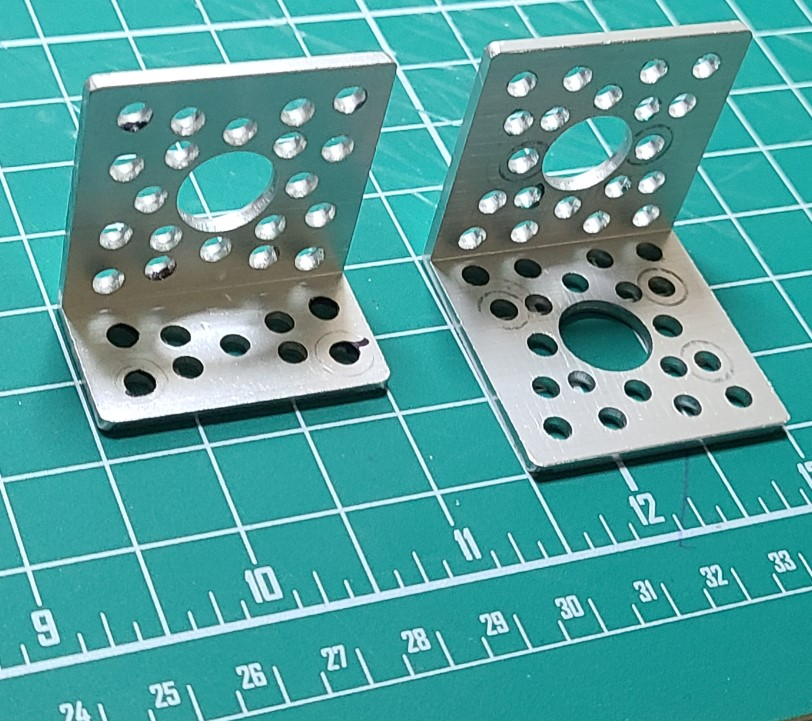
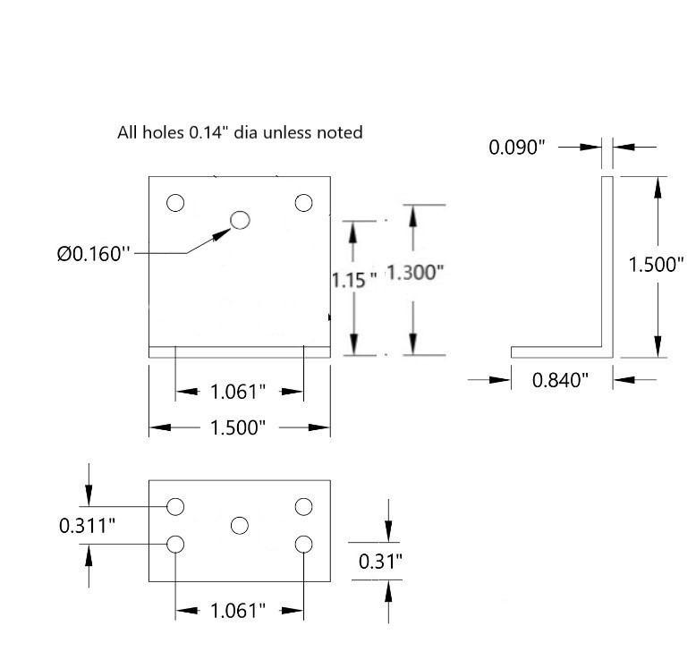
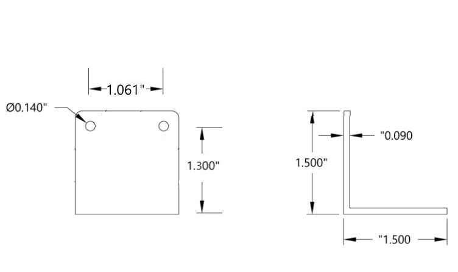

## Brackets
There are 3 brackets used in the build. One larger bracket and two smaller brackets. Options:

1. buy them (the smaller bracket seems to be discontinued, but at least you can buy the larger one).
2. 3d print them from the files in this project.
3. Fabricate them by cutting and drilling aluminum angle, like from [Home Depot](https://www.homedepot.com/p/Everbilt-1-1-2-in-x-96-in-Aluminum-Angle-with-1-16-in-Thick-802597/204273989) or [Amazon](https://www.amazon.com/Aluminum-Angle-Length-T6511-Stock/dp/B07KX8PCYW/)

The larger bracket, used to hold the tail-end of the flight controller, is available from [servocity](https://www.servocity.com/90-single-angle-pattern-bracket/). Description: 90° Single Angle Pattern Bracket, Dimensions 1.5" x 1.5" x 1.5", 0.09" thick, 13gm, $2.

Two smaller brackets are also used. One is used to hold the front-end of the flight controller. The other is used to hold the pitot tube for the airspeed sensor. The smaller brackets were discontinued by the [Servocity](https://www.servocity.com/90-single-angle-short-pattern-bracket/), however a simpler version can be 3d printed from the files from this project. (Print 2 of the small brackets.) Alternately, fabricate the brackets from aluminum angle.

If you fabricate the two small brackets, note that not all holes in the image below need to be drilled in each bracket.

* For the pitot tube bracket, you only need the 5 "bottom" holes plus the larger .16" dia hole.
* For the flight controller bracket, you only need the two "top" holes.

**Small** bracket dimensions (dimensions are approximate, ignore the precision):

**Large** bracket dimensions (dimensions are approximate, ignore the precision):

