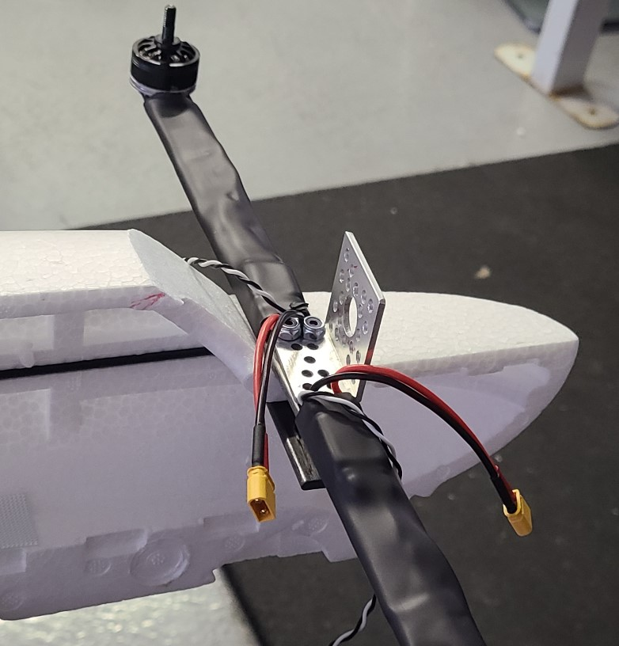
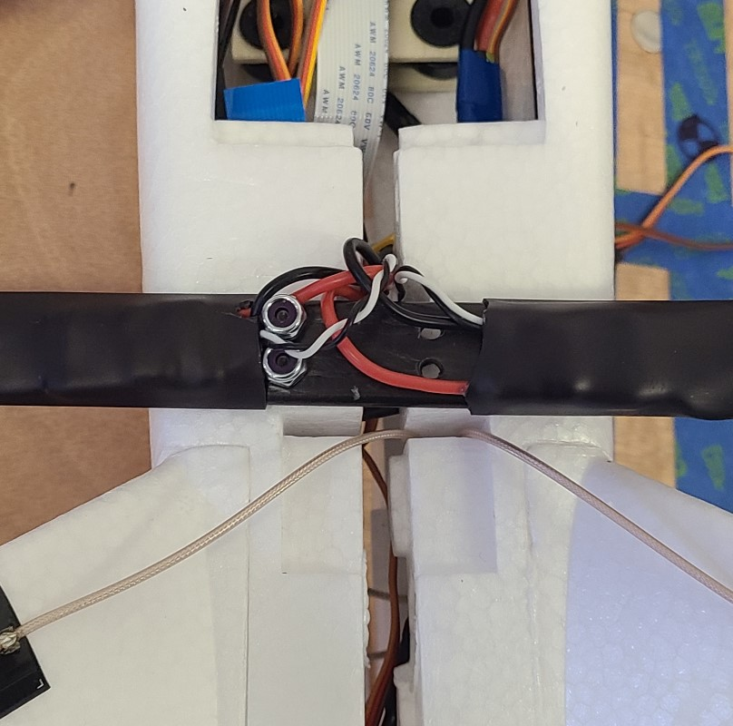
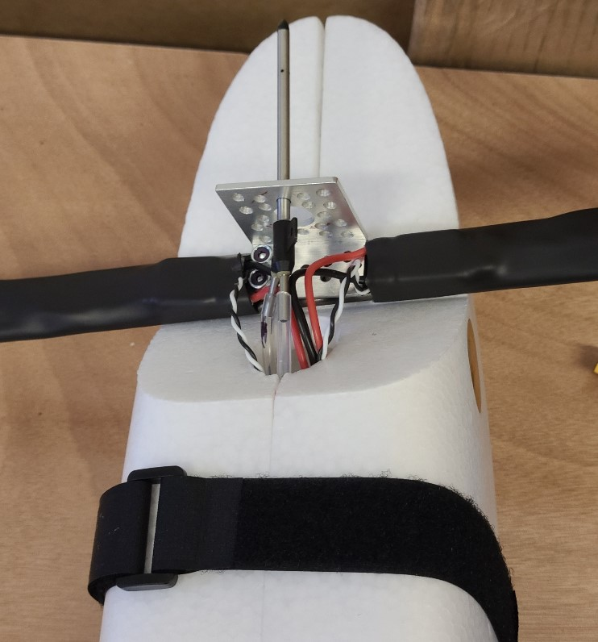
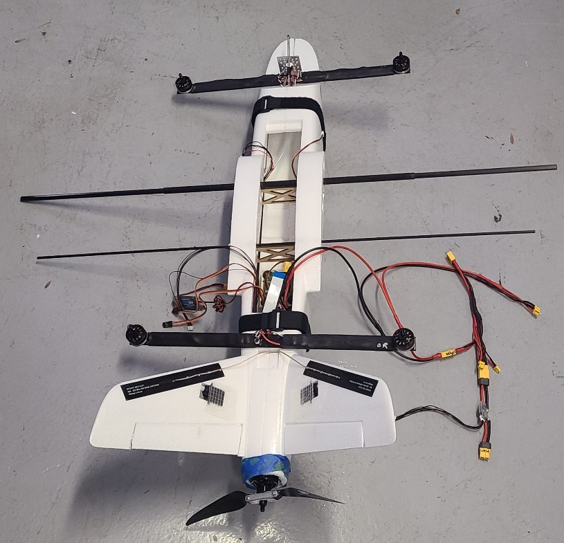
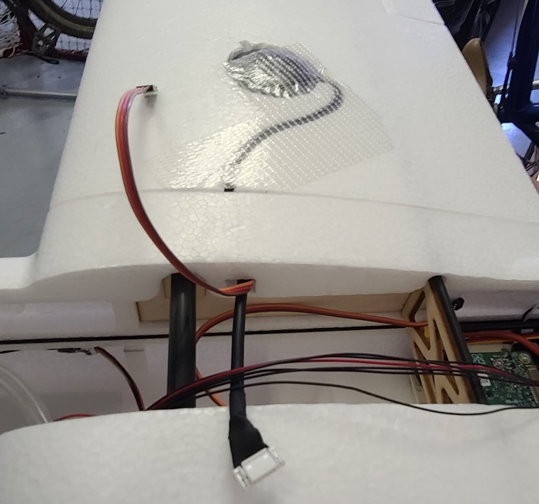

## Airframe Close

Suggestion: do this step twice. The first time, do not glue anything. Instead, secure the fuselage together using velcro straps or masking tape. Once you have confirmed everything works, repeat this task (most of it), gluing as you go.

Caution: The fuselage will be particulary delicate during this task after items like the quadarms are connected but before the fuselage is fully closed.

1. Confirm components are in place inside the fuselage:

    * Confirm that the receiver is in place in the right half of the fuselage.
    * Confirm that the air speed sensor board is velcroed in place in the left half of the fuselage. (Don't worry about the pitot tube for now, just the board)
    * Confirm that the RFD900x radio is in place in the left half of the fuselage.
    * ...

1. Bolt the camera to the left half of the fuselage using 0.875" screws. The screws are inserted thru the top of the middle plate, then thru the fuselage/spacers, then thru the bottom plate. Don't over-tighten.
1. Install wood frame and spars into the left half of the fuselage.

    * Place the wood frame into the left half of the fuselage.
    * slide the hollow spar tube (385mm long, 10mm dia) thru the two larger the holes in the wood box until it is approximately centered.
    * slide thin wing spar (735mm long, 4mm dia) thru the two smaller the holes in the wood box until it is approximately centered.
    * slide the two wing spars (410mm long, 8mm dia) into each end of the spar tube, so that they are approximately centered.  

1. Bolt the front quadarm to the left half of the fuselage using 2x 1.25" screws. (The airframe will very delicate at this stage). The screws will go thru the backing plate, then thru the fuselage/spacers, then the quadarm, then the pitot bracket. Don't over tighten. The 7/64 hex key can be inserted thru the previously-made hole in the bottom of the fuelage.

1. Similarly, bolt the rear quadarm to the left half of the fuselage using 2x 1.5" screws (There is no bracket on the rear quadarm). You may have to temporarily move RFD900x radio.
1. Attach the right half of the fuselage, but only until the halves are about 1.5" apart as follows:  
    * Put the wing spars thru appropriate holes in the right half of the fuselage. Be careful with the quad arms as you start sliding the fuselage halves together. Stop when the halves are about 1.5" apart.
    * Guide the RFD antenna wires from the tail pieces, thru the slot in front of the tail, and then under the quad arm back plate. Attach them to the RFD900x. Then reattach the RFD900x to it's velcro on the left side of the fuselage.
    * Extend the two tail servo wires under the quad arm backplate and along the left side of the fuselage into the area of the wood box.
    * put the plane motor into it's groove in the back of the fuselage (either half). Extend it's ESC forward, under the quadarm backplate, and attach the ESC to the velcro on the right half of the fuselage.
    * Put the pitot tube through top center hole in the bracket that is on top of the forward quad arm.
    * Take the power loom and locate two adjacent XT30 connectors that you labeled "E". Connect them to the two rear ESC connectors that are coming from the rear quad arm. Extend the power loom forward.

1. Now slowly bring the fuselage halves together as follows:

    * Watch the wire locations as you go. Also watch the quadarm backplates and the camera mount.
    * the cables from the rear quad arm will go thru the small circular hole just in front of the quad arm. If necessary you can elongate that 10mm dia hole in the forward direction so it is about 15mm. You can use a hobby knife. 
    * the cables from the forward quad arm will go thru the large front circular hole.
    * the pitot tube hoses will go thru the large front circular hole. 
    * Watch to see that all wires and connections are accessible from the hatch.

1. Use velcro straps and/or masking tape to hold the fuselage together (see image). 
1. Secure the front quadarm to right half of the fuselage with 2x 1.25" screws and nylock nuts:

    * An extra pair of patient hands might be very helpful, but it can be done by one person.
    * It might be helpful to align the pieces by inserting one screw from the top while you work with the other screw from the bottom.
    * Tip: tape the screw to the hex key with masking tape before inserting up thru the bottom of the fuselage. (Yes, the masking tape may end-up inside the plane.)
    * You can see what you're doing thru the hole that is in the bottom front of the fuselage.
    * A rounded-end hex key might be easier to use since the holes in the bottom of the fuselage are not precisely located.
    * Tighten all four consistent with each other while you are in there. You can use needle nose pliers to hold each top nut.

1. Secure the rear quadarm to the right half of the fuselage with 1.5" screws and nylock nuts:

    * See above details for front quadarm. Also, this one is easier to reach from the hatch, so it is easier to guide the screws.

1. Secure the camera to the right half of the fuselage with .875" screws and nylock nuts.

    * the screws are inserted thru the top, all the way thru the top plate (including the head of the screw). The screw head will end-up sitting on the middle plate.

1. Slide the wings over the spars. As each wing gets close to the fuselage, thread the servo cable (and, on the right side, the GPS cable) thru the square hole in the fuselage. Secure each wing by tightening its bottom screw with a 2.5mm hex key. 
