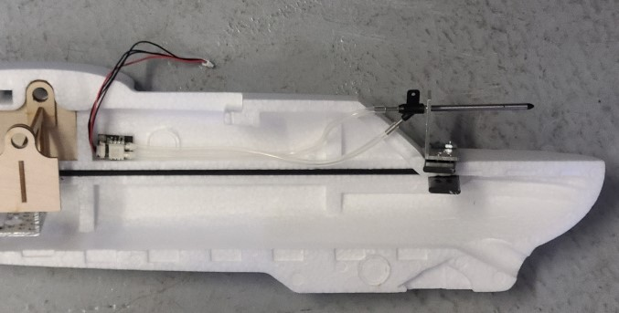

## Airspeed prep
1. Double check the lengths will be OK, then cut the rubber tube roughly in half. Mark one tube at both ends for easier reference later.
1. Choose a spot, on the left side of the fuselage, to mount the sensor board. The connection wires should easily reach the pixhawk where it will be mounted, and  the rubber tubes should easily reach the pitot tube. The pitot tube is not mounted in this step, but it is shown for reference in the image below. (The tube connections might be reversed in the image.)
1. Velcro tape the board to the fuselage.
1. Fiber tape (or velcro tape) the rubber tubing to the fuselage. Make sure the tubes are not kinked in any way.
1. The tip of the pitot tube may come loose. If it does not feel secure, carefully glue it in place without blocking the air hole.

