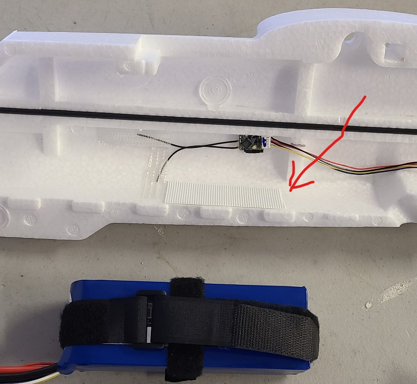

## Battery Velcro

The battery will go in front of the wood frame in the fuselage, on the floor. It's exact position will be determined later when adjusting the center of gravity.

The battery(s) will be wrapped in two velcro straps. The straps will then be attached to velcro tape that is on the bottom of the fuselage.  Battery dimensions: 168 x 69 x 38 mm

Steps:

1. Use an 18" velcro strap to snugly wrap the battery lengthwise. Use an 8" velcro strap to snugly wrap the battery widthwise. The soft, fuzzy side of the velcro should be exposed.
1. Cut two strips of velcro tape, just the "hook" side" (non-fuzzy, non-soft), 1" x 9".
1. Attach one strip to the floor of the *left* half of the fuselage. The tape will run along the seam, just forward of the location of the internal wood frame.
1. Before installing the other strip on the *right* half of the fuselage, cut it into separate pieces that avoid the receiver antenna. You want to be able to remove the receiver or the battery velcro without disturbing the other. In the image below, only part of the right half strip has been applied.
1. When finished, remove the battery velcro and safely store the battery until it is needed again.

