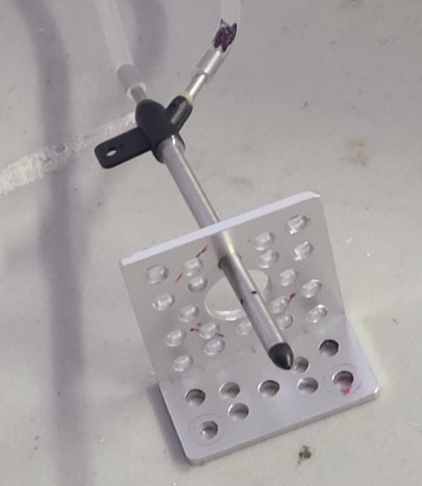

## Bracket prep
There are three brackets in this build.

* a small bracket that is bolted to the forward quad arm and holds the pitot tube.
* a small bracket that holds the front of the flight controller,
* a large bracket that holds the rear of the flight controller.

#### If you 3D printed the brackets...
...then you are done with this step. Ref: [3d prints](../parts/3dprints.md)

#### If you purchased the brackets...
the bracket center top hole on ONE small bracket needs to be drilled/opened-up from 3.6mm dia (.14") in order to fit the pitot tube which is 4mm dia (.16") per the image below. An 11/46" drill bit works.

#### If you are fabricating the brackets out of aluminum angle...
cut and drill 3 brackets per the dimensions in the images below.

* Small bracket for pitot tube: only needs 6 holes: the 5 base holes plus the .16" dia hole.
* Small bracket for flight controller front: only needs 2 holes: the 2 "top" holes.
* Large bracket for flight controller rear: only needs 2 holes per the sketch.

#### Images
Pitot tube hole:

Small bracket rough dimensions: See notes above about which holes are not required.

Large bracket rough dimensions:

