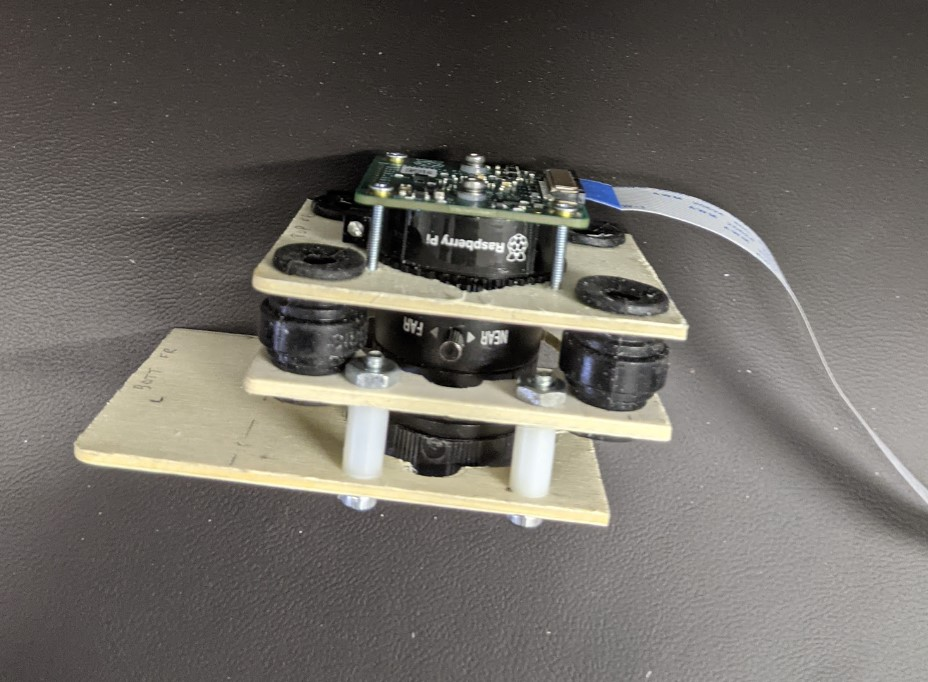

## Camera assemble

1. Remove the tripod mount from the camera.
1. Assemble the lens to the camera body.
1. Loosen the nobs on the lens and set the lens to the full "far" and full "open" positions (approximately). Subsequent assembly is easier if the nobs line-up with each other on the side. Tighten the nobs.
1. Bolt the top plate to the camera.

    * The plate slides over the lens, "top" side first. The ribbon cable is on the "back" of the camera.
    * Use the 2-56 0.75" long screws. The screws go thru the camera first, then the plate, so that the 2-56 nuts will be against the plate. Tighten until snug.

1. Attach the mid plate to the top plate using the dampers. (The plate slides over the lens.)

Note:  The bottom plate goes on the outside of the fuselage, so it will be attached at a later step. It is shown in the image below for reference only.

