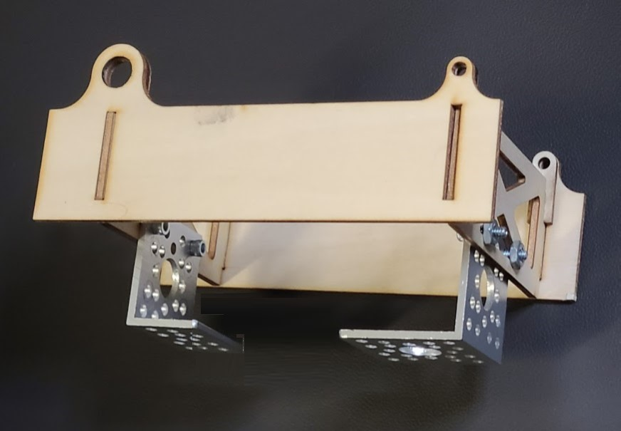

## Frame brackets

Two simple brackets will support the flight controller. The small bracket is used in front so that the flight controller will be mounted towards the front. The flight controller will sit on 4 vibration-damping foam velcro pieces that were included with the Pixhawk 4 bundle.

1. Attach the small frame bracket to the front of the wood box, using 2x 0.375" screws and nyloc nuts.
1. Similarly, attach the large frame bracket to the rear of the wood box.
1. Position the velcro pieces that so that the flight controller is close to (but not touching) the vertical surface of the small bracket. (The flight controller should also be centered side-to-side.)

