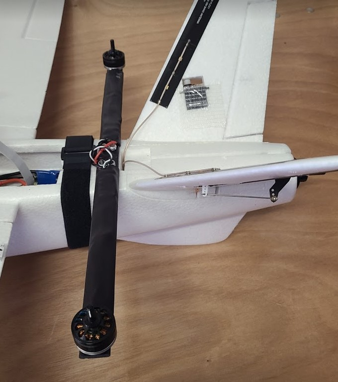
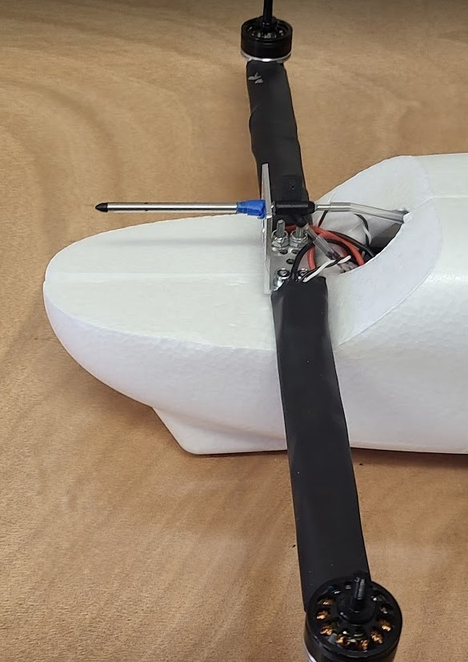
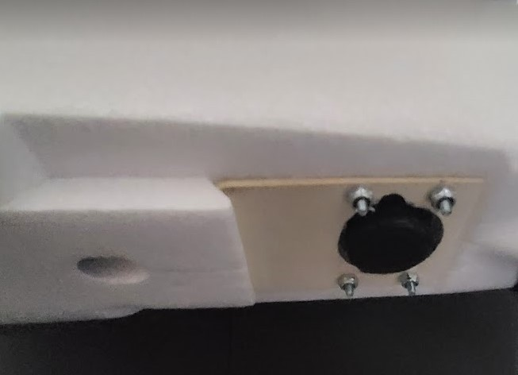
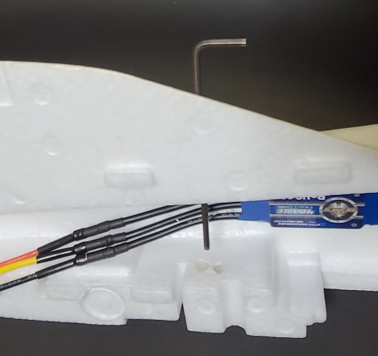
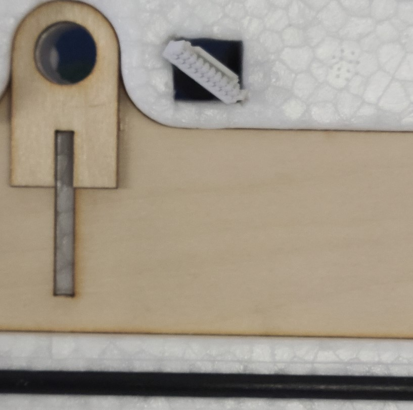

## Fuselage Prep

This step primarily involves creating & modifying holes in the fuselage, and installing spacers in the fuselage.

1. Use velcro straps or masking tape to temporarily put the fuselage halves together.

1. Create 8 holes in  the fuselage for the quad arms (4 front holes and 4 back holes). The images below show placement locations for the quadarms. The center of the rear quadarm is about 40mm from edge of the hatch. The front quadarm is flush against the angled section.

    * Use a quad arm back plate as a template for hole locations.
    * The holes should be small enough that the spacers will be very snug, less than 6.4mm (0.25") diameter. A 13/64" drill bit works well. Since the plane material is soft, you can drill the holes by hand.
    
      

1. Create 4 bolt holes in the fuselage for the camera mount.

    * use the bottom plate as a template for hole locations. Make sure it is oriented correctly, with the holes towards the rear and the extra material towards the front. See image below.
    * The holes should be small enough that the spacers will be very snug, less than 6.4mm (0.25") diameter. A 13/64" drill bit works well. You can drill the holes by hand.
      

1. Cut a hole in the fuselage for the camera lens. A hobby knife works well. Use the bottom plate as a template.
1. install 12 spacers into the fuselage and glue them in place.

    * 4x 0.375" long spacers for camera.
    * 4x 0.375" long for front quad arms.
    * 4x 1" long for rear quadarm.

1. Poke holes in bottom of the fuselage.

    * The holes will be used to insert a 7/64" hex key to tighten the quad-arm screws in a later task.
    * There are 8 quad arm screws but you only need 4 holes since the pairs are close enough together to share a wrench hole: 2 holes in front, 2 holes in back. The front wrench holes can go thru the wheel indentation in front.
    * Tip: poke a hole with a thin hex key, then open-up the hole to about 1/8" (3.2mm) dia with the larger hex key.
    * The holes on the right half of the fuselage will need to be slightly larger in diameter, about .224" or 5.7mm, so that the head of the associated screws can fit thru them. A 7/32" drill bit works for this.
    

1. The GPS plug needs to fit through the square hole thru the right side of the fuselage. The plug is about 14mm in width, and the hole is about 14mm diagonal. If the plug does not go thru easily, you can file two corners of the hole.  

