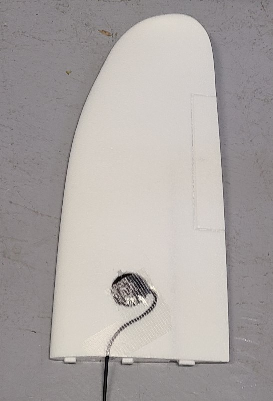

## GPS mount
The GPS will be countersunk into the right-side wing, using a hobby knife.

1. Mark the location of the gps on the right wing.

    * Draw a 50mm diameter circle on top of the right wing.
    * The front edge of circle should be about 75mm from the leading edge of the wing (this is a thick part of the wing but avoids the carbon spar in the wing).
    * The left edge of the circle should be about 70mm from the inside edge of wing (far enough from other components interference, but close enough for cable to connect to pixhawk).

1. Mark the cord path along the top of the wing. Use the cord as a guide to determine the sharpness of the curves. The cord, exiting the aft of the gps, will curve forward and left, leaving the wing on the left side about 80mm from the leading edge of the wing. See image below. (80mm from the leading edge corresponds with a square conduit hole in the fuselage)
1. Cut the circle for the GPS. It should be about 15mm deep.
1. Cut the cord groove so that the cord can be roughly flush with the wing. Exception: Where the wing meets the fuselage, the groove should deepen to about 17mm in order to line-up with the square conduit hole in the fuselage.
1. Cut a notch so that the button switch on the GPS can easily be reached/pressed/held-down. (The notch in the image below is too small -- make it bigger so a finger can easily press the button)
1. Tape over the GPS and cord on the wing surface. Leave the switch accessible and don't obscure the lights on the GPS.

