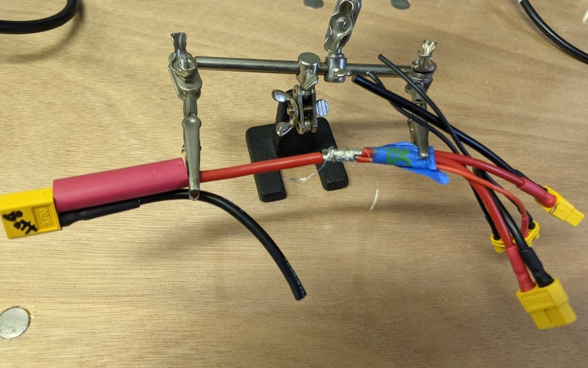
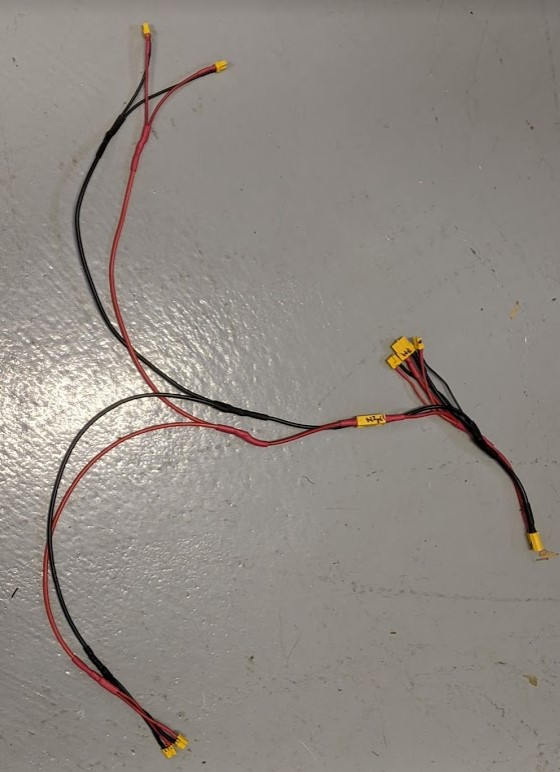

## Power Loom Nodes
This step involves soldering some distribution joints to create nodes to split power (and ground) from one wire to multiple wires. There are alternatives to soldering, including purchased blocks/connectors/nuts.

This task, combined with the previous [XT to wires](xtwires.md) task, completes the power loom (see image at bottom).

Ref: Quotes below are from [Soldering Multiple Wires for a Distribution Joint](https://www.instructables.com/Soldering-multiple-wires-for-a-distribution-joint/).

For each of the nodes listed below, you will be working exclusively with red wires or with black wires. The two are not mixed. The general procedure is as follows:

**Start:** Cut 100 mm of 20 AWG wire (or any size, and any color). Strip all insulation from this piece. Strands of this will be used to make thinner "wrap wires" to wrap the joints. To make each "wrap wire", pull a few strands free and twist them together.

**For each section in the table below:**

1. Strip the input wire (listed in table).
1. Strip the output wires (listed in table).
1. Cut the heat shrink (listed in the table). Slide the heat shrink over the input wire, way down, away from the stripped end for now.
1. "Bundle the output wires together with whatever temporary method works (tape, zip ties, clamps, all of the above)" while trying "to insert the end of the input wire into the center of the bundle." See image below.
1. Wrap the entire bundle tightly with your wrap wire. Excess wrap wire can be trimmed later.
1. Solder the joint. It helps to use a broad tip with higher temperatures. "Heat up the joint and melt the solder with the wire, not the soldering iron. You should see the solder flow between the strands through the whole bundle. Work from multiple angles and make sure to get thorough coverage."
1. let it cool then trim the excess wrap wire.
1. Remove the tape (if applicable), then slide the heat shrink over the joint and shrink it with a heat gun.

**Finish** by connecting the power module (PM02) to the power loom's XT60 connector (the XT60 connector that you labeled "PM")

You can check work by connecting a battery and using a voltmeter. And/or check resistance.

| node | color | input wire | gage | strip | heat shrink dia, length | outputs | gage | strip |
| -- | -- | -- | -- | -- | -- | -- | -- | -- |
| MAIN | red | ["batt"](xtwires.md) | 12 AWG | 10mm | 3/8", 40mm |  |  |  |
|  |  |  |  |  |  | N1 | 14AWG | 10mm |
|  |  |  |  |  |  | PM | 14AWG | 10mm |
|  |  |  |  |  |  | B | 20AWG | 10mm |
|  |  |  |  |  |  | B | 20AWG | 10mm |
| MAIN | black | "batt" | 12 AWG | 10mm | 3/8", 40mm |  |  |  |
|  |  |  |  |  |  | N1 | 14AWG | 10mm |
|  |  |  |  |  |  | PM | 14AWG | 10mm |
|  |  |  |  |  |  | B | 20AWG | 10mm |
|  |  |  |  |  |  | B | 20AWG | 10mm |
| ESC | red | N2 | 14AWG | 15mm | 1/4", 40mm |  |  |  |
|  |  |  |  |  |  | wire 350mm | 14 AWG | 10mm |
|  |  |  |  |  |  | wire 300mm  | 14 AWG | 10mm |
| ESC** | black | N2 | 14AWG | 15mm | 1/4", 40mm |  |  |  |
|  |  |  |  |  |  | wire 350mm | 14 AWG | 10mm |
|  |  |  |  |  |  | wire 300mm  | 14 AWG | 10mm |
| Front | red | ESC (longer)** | 14AWG | 15mm | 3/16", 40mm |  |  |  |
|  |  |  |  |  |  | E | 18AWG | 10mm |
|  |  |  |  |  |  | E | 18AWG | 10mm |
| Front | black | ESC (longer)** | 14AWG | 15mm | 3/16", 40mm |  |  |  |
|  |  |  |  |  |  | E | 18AWG | 10mm |
|  |  |  |  |  |  | E | 18AWG | 10mm |
| Rear | red | ESC (shorter)** | 14AWG | 15mm | 3/16", 40mm |  |  |  |
|  |  |  |  |  |  | E | 18AWG | 10mm |
|  |  |  |  |  |  | E | 18AWG | 10mm |
| Rear | black | ESC (shorter)** | 14AWG | 15mm | 3/16", 40mm |  |  |  |
|  |  |  |  |  |  | E | 18AWG | 10mm |
|  |  |  |  |  |  | E | 18AWG | 10mm |
|  |  |  |  |  |  |  |  |  |

\*\*After the ESC nodes: temporarily tape the short black to the short red, and the long black to the long red, so they stay together and don't get mixed-up. For the Front node, the input wires are the longer 14 AWG wires from the ESC node you just made. For the Rear node, the input wires are the shorter 14 AWG wires from the ESC node you just made.

