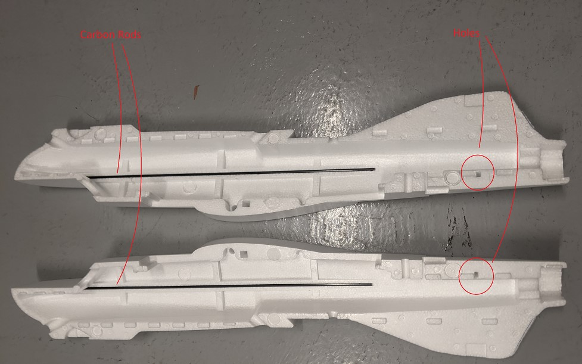
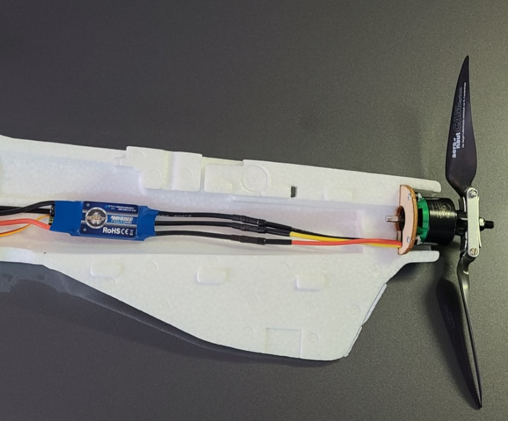

## Plane ESC mount
Two things happen in this task

* Install carbon rods in side of fuselage.
* Put velcro tape in a good location on the fuselage for the plane ESC.

Steps:

1. Place the carbon rod/tubes (included with airframe) into the each side of the fuselage. Glue in place. See image below.
1. Connect the plane ESC to the plane motor assembly.
1. Attach the ESC to the right side of the fuselage using velcro tape. See image for approximate location.
1. After the above steps are complete, remove the motor and ESC from the fuselage half. They will be put back later when the fuselage is closed.
