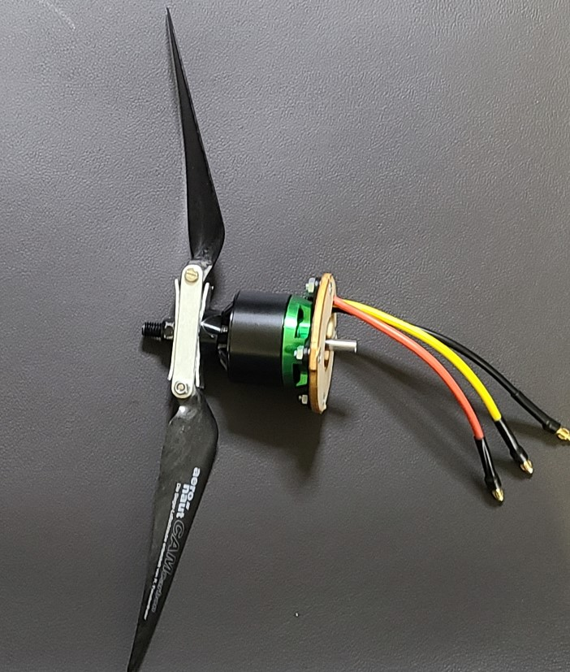

## Plane motor mount

1. Install the cross mount (x-shaped piece) onto the plane motor using the countersunk screws. (All pieces are included with motor).
1. Find the circular wooden motor mount piece that is included in the mini talon. Widen it's slot to about 11mm to allow room for the motor cables to pass thru when the motor is attached to the wood piece. A hobby knife works.
1. Open-up the four holes on the wooden piece to about 3mm dia. M3 screws should fit snugly through these holes.
1. Push or thread the 4 [M3 8mm screws](../parts/screwsetc.md) thru the wooden piece. Then place the motor over the protruding screws while threading the cables thru the slot. Attach with the 4 nuts. The wood is soft enough that the screw heads can sink into the wood a bit, making it easier to fit it into the airframe, but do not tighten to the point of weakening the wood piece.
1. Attach the bolt on prop adapter to the motor. (all pieces included with the motor)
1. Attach the props onto the holder. (hardware included with holder)
1. make blade stops, qty 2: 12mm x 37mm with a 6-8mm hole in the center. The dimensions might need to be finessed a bit. You can use an old credit card or thin plywood or snip the pieces from 1mm thick aluminum plate. The purpose of the forward blade stop is to prevent the blades from folding forwards too much where they could damage the tail.  The rear blade stop is to keep the blade tips from crossing. It might help to slightly bend the ends of the blade stops so that the blades can move freely but not move too far. You can alternatively 3d print something [like this](http://www.itsqv.com/QVM/index.php?title=How_To_-_Set-Up_a_Pusher_Style_Folding_Prop#3D_Printed_Insert).
1. Finish the assembly by sliding these items over the shaft in this order: fwd blade stop -> bushing -> prop holder -> rear blade stop -> nut (nut included with motor, 10mm wrench).

Ref:  

* [How To - Set-Up a Pusher Style Folding Prop](http://www.itsqv.com/QVM/index.php?title=How_To_-_Set-Up_a_Pusher_Style_Folding_Prop)
* [Folding pusher prop 101](https://www.youtube.com/watch?v=Ta9ORLZyXlI)  
* [Balancing a folding prop](https://www.youtube.com/watch?v=iHYqvcEFmQE)
