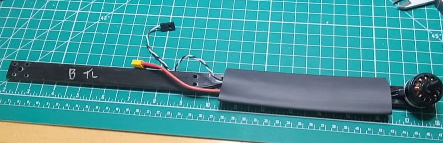
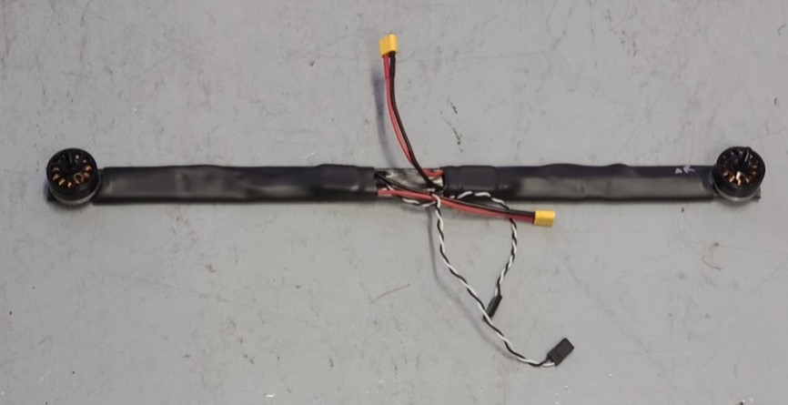

## Quadarm Assemble

Do the following for *each* of the four quad motors (and two quadarm pieces).

1. note the labels on the quad arms (like "BRT" for group B, Right, Top) and do not lose track of them. The labels may get covered by heat shrink.
1. Cut a 5 3/4" length of 3/4" diameter heat shrink.
1. Take the wires and ESC that are attached to one of the quad motors and thread them thru the heat shrink.
1. slide a quad arm thru the same piece of heat shrink. The wires (and motor) should be on top of the arm. The motor holes should line-up with the screw holes.
1. bolt that motor (with ESC) to the quad arm. Use [M3 8mm screws](..parts/screwsetc.md). Loctite? (the thread length of the screws supplied with the motors is about 5mm)
1. The heat shrink should not contact the motor and it should be clear of the mounting holes at the center of the arm. Use a heat gun to shrink the piece. If the previous labels (like "BRT") get covered-up, re-label the arm.
1. let it cool before continuing.
1. Connect a 13" (8" might work too) servo extension to the quad motor ESC. Make sure it is oriented so the wire colors are consistent. Label the loose ends "RF", "LF", "RR", or "LR" (for "right front", "left front", "right rear", "left rear")
1. (Repeat the above steps for each of the four quad motors.)

