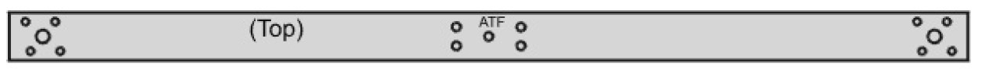
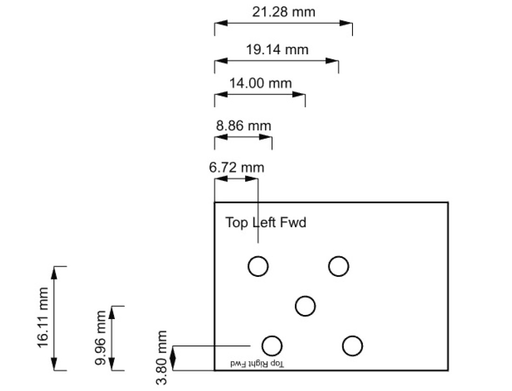

## Quadarm Prep
This task uses the [1000mm long quadarm material](../parts/quadarm.md). It also uses a piece of [aluminum or similar material for making a template](../toolsetc.md) which is helpful for motor hole alignment.

Reminder: [work safely](../safety.md), including when working with carbon fiber.

#### Initial cut and drill
1. Cut 2 pieces 400 mm in length, and cut 2 pieces 70mm in length. The resulting pieces are the two arms that hold the quad motors plus two mounting backplates.
2. Drill a 9/64" dia hole in the centers of the four pieces.

#### drill holes for fuselage mount
1. Bolt a  long piece, a short piece, and the [pitot tube bracket](bracket_prep.md) together. The bracket is used here for hole alignment. You can use some of the [6-32 screws](../parts/screwsetc.md) temporarily here, they will be installed at a later step.
2. Now drill the four bolt holes. These four central holes will be used to mount the arm and backplate to the fuselage. Use the bracket to determine hole positions. After each hole is drilled, it helps alignment if you put a bolt thru the additional hole before drilling the next hole.
3. Unbolt and label the arm and black plate "ATF". "A" is for group A. "T" is for top. "F" is for front. The markings allow easy re-matching and aligning later.
4. Repeat the last three steps with the other short/long piece combination, except label those two pieces "BTF". (Theoretically the "A" parts will be identical to the "B"" parts, but labeling them "A" and "B" helps keep the parts together that were drilled together)

#### Make template for quad motor mount holes: 3D print or fabricate
Option 1: 3D print the motor-hole-template per the file in this project, label it per the sketch below ("top left fwd" and "top right fwd").

Option 2: Fabricate the motor-hole-template per the following:

1. Drill 5 holes, 1/8" (3mm) diameter, in the locations shown. Don't be bothered by the two decimal places -- the numbers are approximate. 
2. You can test the accuracy of your hole positions by trying to bolt a quad motor thru the template (M3 screws: Make sure they don't hit the motor coils).
3. Label the top of the template as shown in the image ("top left fwd" and "top right fwd").

#### drill quad motor mount holes
1. clamp the template to the left end of quadarm A. Align the **rear and left** edges of the template with the rear and left edges of the quadarm.
2. drill the center hole, then drill the four other holes. Use the template to determine hole positions. After each hole is drilled, it helps alignment if you put a bolt (M3) thru the additional hole before drilling the next hole.
3. Repeat for the right end of quadarm A, aligning the **front and right** edges.
4. Repeat for the left end of quadarm B, aligning the rear and left edges.
5. Repeat for the right end of quadarm B, aligning the front and right edges.
6. At the four ends of the quadarms, open-up the center holes to 7/32" (5.5mm) diameter. This gives more clearance for the ends of the motor shafts.
