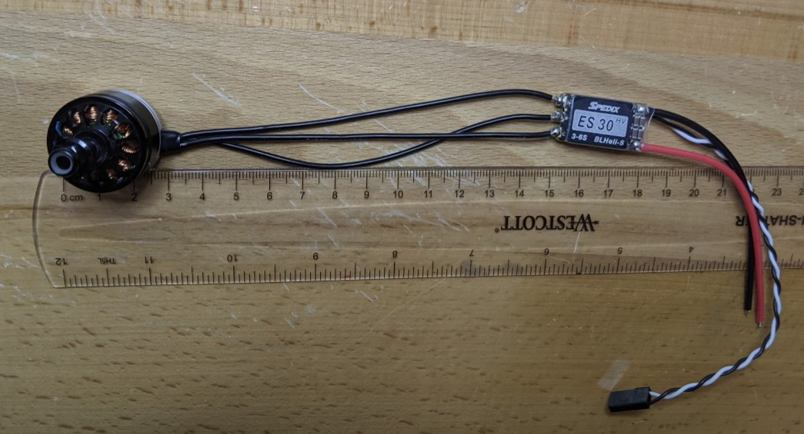

## Quad ESC solder
Do these steps four times to solder the quad motors to quad ESCs:

1. The wire length between the motor and the ESC should be roughly 110mm (photo shows 120mm). This is derived as follows:

    * end of quad arm to centerline of fuselage 200mm,
    * minus motor diameter 25mm
    * minus ESC length 30mm
    * minus space for quadarm mounting screws 35mm.

2. The 3 motor wires on the ESC should be already prepped. If not, strip about 3mm of insulation and tin them.
3. Tin the pads on the ESC. Ref: https://oscarliang.com/soldering-guide/#small-wire
4. The motor direction will be determined by the ESC setup later, so it doesn't matter which of the three wires is soldered to which pad. Solder the three motor wires to the three ESC pads. [Here's an example, "HOW TO SOLDER MOTOR WIRES TO ESC FOR BEGINNERS"](https://www.youtube.com/watch?v=WTbV80LQeYs)

