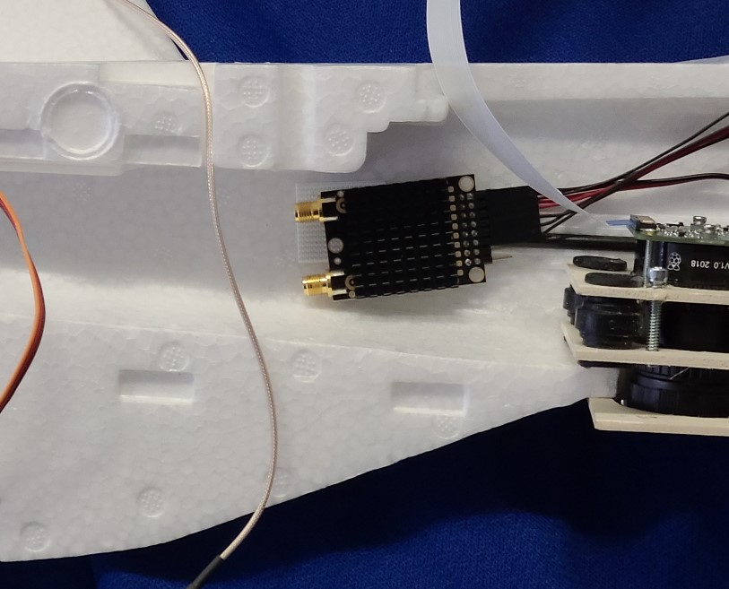

## Radio mount

1. Choose a spot on the left side of the fuselage to mount the RFD900 so that the antenna wires can easily be easily attached to the tail when mounted. Also, keep the RFD900 clear of the camera mount. (see image)
2. Velcro tape the RFD900 to the left side of the fuselage. Don't put velcro tape over the black knobby heat sink; keep that clear.
3. After the above steps are complete, remove the RFD900x and it's BEC from the fuselage half (leaving half the velcro tape attached to the fuselage). The radio will be reattached when the fuselage is closed.

