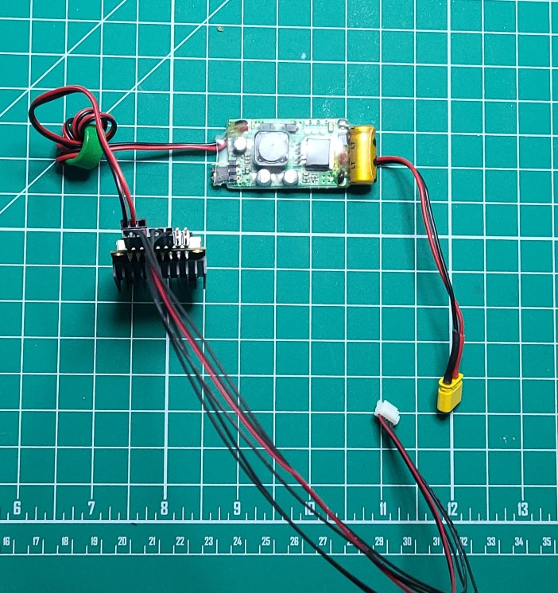

## Radio wires
This is for the modem attached to the plane, the other half sstays on the ground.

ref: http://files.rfdesign.com.au/Files/documents/RFD900x%20DataSheet.pdf

1. Remove jumper connecting pins 4 and 6.
1. If not already done in [BEC prep](bec_prep.md), take the output wire (the one with the servo plug on it) and wrap it around the BEC's included ferrite core 5 times (per the BEC's instructions).
1. Connect the BEC output to pins 2 (ground -- black) and 4 (+5V -- red). Looking at the label side of the RFD, the black wire connects to the top left.
1. Connect the 6 wire Pixhawk connector to pins 1,3,5(red),7,9,11. The cable was included in the radio bundle. Looking at the label side of the RFD, this connector goes underneath the BEC connector, with the red wire third from left.

