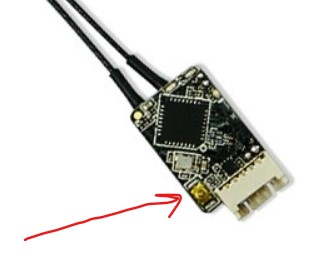

## Receiver Bind to Transmitter

This step binds the receiver to the transmitter. It is easier to do this before the receiver and flight controller are mounted in the fuselage.

The only purpose of the flight controller in this step is to power the receiver. There are other methods to power the receiver.

1. Connect receiver to the pixhawk 4's DSM/SBUS RC port (using the cord provided with the pixhawk).
2. Plug the micro USB cable (provided with the pixhawk) into the pixhawk. Get the large "A" side of the USB cable ready to plug into a computer or other power source.
3. Power on the transmitter, and put it in bind mode. (For Taranis Q X7S transmitter: power on, tap menu, (select model), press PAGE, scroll down to internal RF. For Mode choose D16. channel range?1-8? press Bind. choose "Ch1-8, Telem ON")
4. While holding the failsafe F/S button on the receiver (see image), provide power to it by plugging in the loose end of the USB cable. You should now see a solid green and blinking red light on the receiver. Disconnect the power.
4. Take the transmitter out of bind mode.
5. To check binding status: With the transmitter still powered on, re-apply power to the receiver. You should see a solid green light (no red).

What about if problems? Find the links to get firmware synced.

reference:

* https://www.youtube.com/watch?v=UH13IA9Y5uI
* https://www.youtube.com/watch?v=zcsCMYU7--M
* https://mozzie.readthedocs.io/en/latest/RXSetup.html
* https://oscarliang.com/bind-frsky-receiver/
