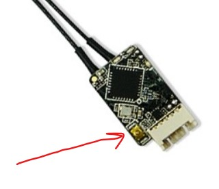

## Receiver Mount

Attach the receiver to the fuselage with velcro tape. Use fiber tape to secure the antennas.

1. Choose a spot to mount the receiver so that:

    * The connection wires can easily reach the pixhawk when it is mounted.
    * Where you can secure the stripped portions of the wire antennas. Ideally the stripped portions of the antennae should be (a) kept straight, (b) far apart from each other, and (c) at right angles to each other. (The shielded/insulated portion of the antennae can be curved. Don't trim the antennae; they should be the same length.) Per the image below, the one antenna is pointed straight forward, the other wraps down so that the bare part runs straight across the floor of the fuselage. The floor piece fits entirely on the right half of the fuselage and doesn't cross the seam.
    * Also, try to keep the failsafe button accessible (red arrow in image). The failsafe button is used when binding the receiver to a transmitter, which was done in a previous task. Keep it accessible in case you switch transmitters.

2. Velcro tape the receiver to the fuselage.
3. Fiber tape the antennas to the fuselage.

