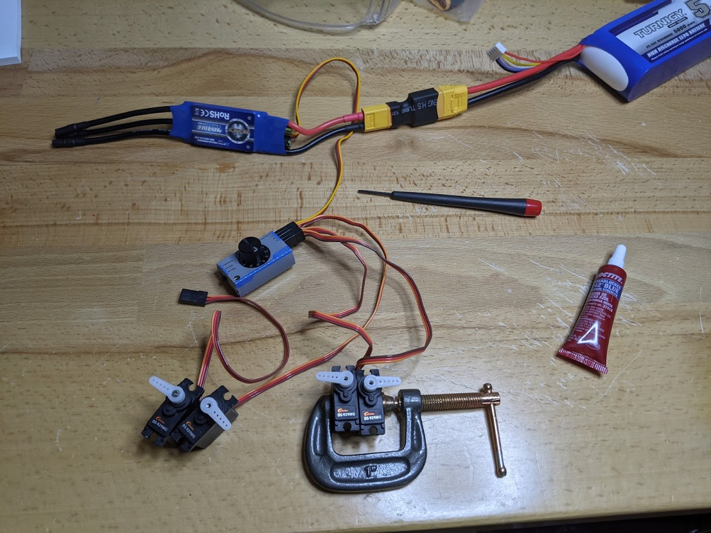

## Servo servo_setup

This task then finds the middle position of the four servos, then attaches the servo horns. Two horns will point left and two will point right.

Make sure everything is clear of servos before attaching battery. (They will rotate on connection)

For power you'll need 5V, so the following will be connected: plane’s battery (connected last) –> [XT90 to XT60 adapter](../parts/xt.md) –> plane’s BEC to convert to 5V –> servo tester -> servos.

## steps ##
1. Connect everything except battery.
1. Switch servo tester to “neutral”.
1. When everything is clear of the servos, connect battery. Servos will rotate to neutral position.
1. (You can make sure the servos are working by switching the servo tester to “automatic”; they should start moving)
1. With servo tester in “neutral” mode, place horns onto the output shaft. On two of the servos, place the horn to point 90 degrees to the left. On the other two servos, place the horn to point 90 degrees to the right (see photo).
1. Disconnect battery.
1. Do not get Loctite/thread locker on plastic. Use a very small bit of Loctite on the servo horn screws, (tweezers and cotton swab), and secure the servo horns to the servos (small Philips screwdriver).

Ref video: https://www.youtube.com/watch?v=wOIV1dcDF7U
