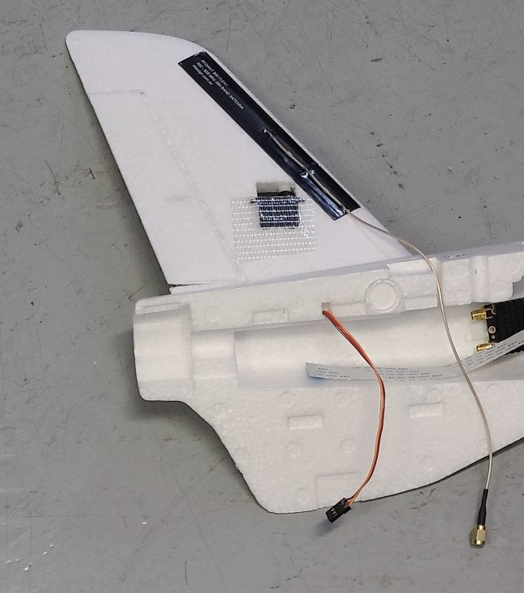

## Tail Glue

Glue the two v-tail pieces to the fuselage. For each one:

1. Match the proper tail piece with the correct fuselage half.
1. Thread the servo cable thru the rectangular hole. The antenna wire can go in the slot just forward of the tail.
1. Glue the tail in place.

