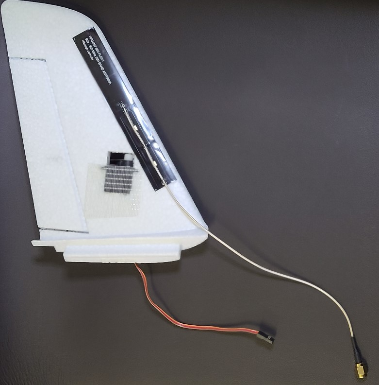
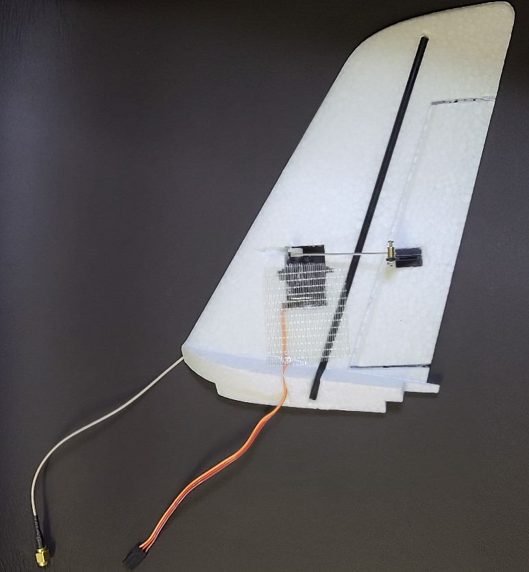
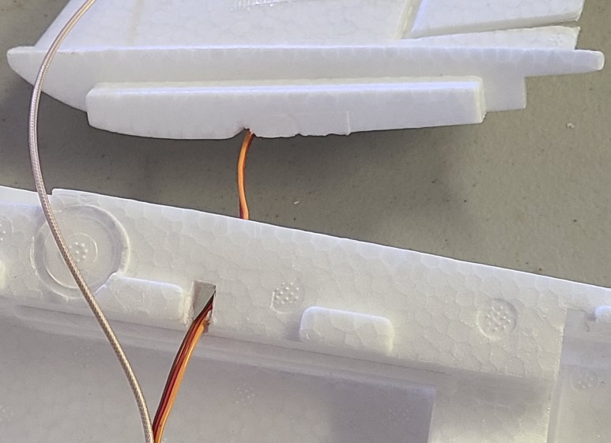

# Tail Setup
This task is very similar to the [wing setup](wing_setup.md) task. Consider doing them together, especially the glue steps.

#### Do the following for both tail pieces.  
## Fit / Prep / Sand:  

1. If the ruddervator control surfaces cannot hinge freely, use a hobby knife on the sides to free them.
1. The carbon rods that came with the mini talon may be too long. If that is the case, you can increase the length of the channel so that the rod does not extend beyond the bottom of the tail piece. (Or trim the rod)
1. Key the rod by sanding it. Wipe it clean. (Sanding makes a better surface for the glue to adhere.)
1. The servos may not fit in the tail pieces. If that's the case, use a hobby knife to remove material from the tail so that the servos fit snugly. (see images below)
1. Sand the 3 sides of the servo that will be in contact with the foam. Wipe the servo clean.

## Glue:  

1. Have paper towels or cloths ready to catch glue drips, spills, and overflows.
1. Glue the carbon rod to the tail piece.
1. Glue the control horn (included with mini talon) to the tail piece, into the recess on the tail. Orient the holes of the horn so they are closest to the servo.
1. Place the servos in the tail pieces, so that the servo horn is pointing straight up on the same side as the control horn. Glue the servo in place. Make sure the glue doesn't contact the moving parts.
1. Wipe away any excess glue.
1. (Wait for the glue to dry, possibly overnight)

## Finish:

1. Insert the servo cable so it is flush in the channel on the tail piece.
1. Attach the servo to the control horn with the control rod. (Rod and hardware are provided with the mini talon.) Before tightening, adjust it so that the neutral position of the servo (straight-up) corresponds with the neutral position of the ruddervator. The control rods provided with the [airframe](../parts/airframe.md) should be snug in the holes. They may not fit in the holes on the horns provided with the [servos](../parts/servos.md). If that is the case, you can use a pointed hobby knife to open-up the holes. Insert the knife into each side of the "end" hole and rotate it gently to remove enough material. Dab a tiny amount of loctite on the threads with a cotton swab, but do not get loctite on any plastic.
1. Use a hobby knife to notch the foam so that the servos and control rods can move freely (This is a precaution that may not be necessary).
1. Attach the RFD900_antenna.md to the tail, on the inside surface (the side without the servo horns). See images below.
1. Secure the servo with tape on both sides, leaving space for the servo horn. Try to keep the tape from overlapping the antenna. (see images)

1. Dry fit each tail piece into the fuselage, threading the servo cable through the square hole. Do not glue at this time. If necessary, extend the groove for the servo cable so it does not interfere with the fit of the tail into the fuselage (see image).

1. connect 13" (8" might work too) servo extensions to tail servos. Make sure they are oriented so the wire colors are consistent. Label the loose ends "RT" and "LT" (for "right tail" and "left tail")
1. (The tail pieces cam be removed from the fuselage; they'll be attached in a later task.)
