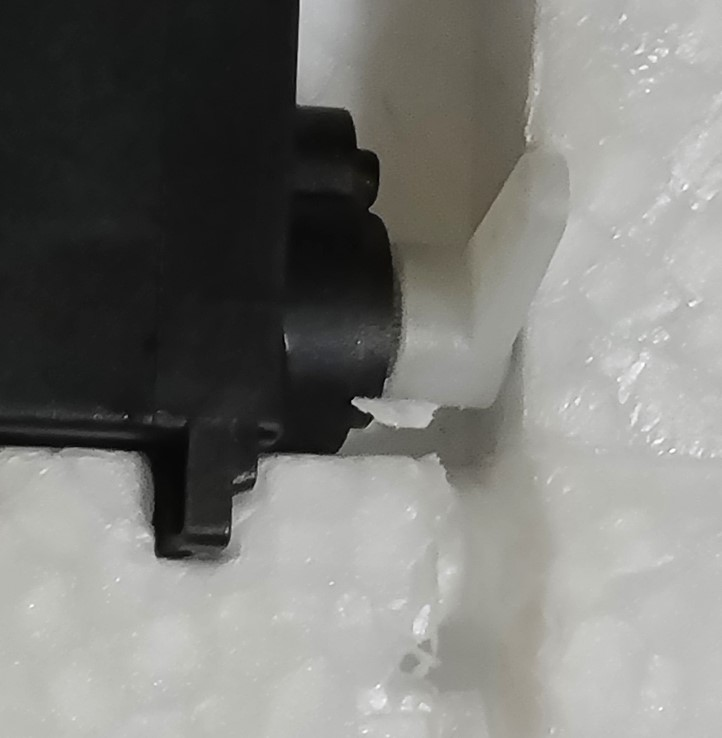
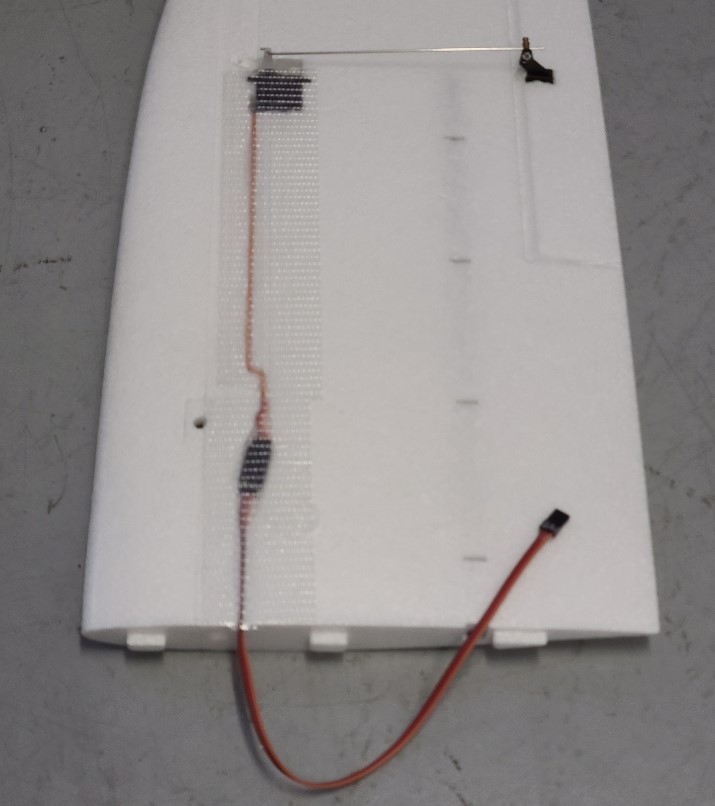

## Wing Setup
This task is very similar to the [tail setup](tail_setup.md) task. Consider doing them together, especially the glue steps.

#### Do the following for both wings.  
Fit/Prep/Sand:  

1. The servo may not fit in the cavity. If that's the case, use a hobby knife to remove material from the wing so that the servo fits snugly. (see image below)
1. connect 13" (8" might work too) servo extensions to the servos. Make sure they are oriented so the wire colors are consistent. Label the loose ends "RW" and "LW" (for "right wing" and "left wing")
1. Insert the servo cable so it is flush in the channel on the wing. You may need to make the channel slightly deeper (hobby knife). Also, scrape away material to allow the servo plug and servo extension to be mounted flush into the wing. (see image)
1. If the ailerons cannot hinge freely, use a hobby knife on the sides to free them.
1. Sand the 4 sides of the servo that will be in contact with the foam. Wipe the servo clean. (Sanding makes a better surface for glue to adhere.)

Glue:  

1. Have paper towels or cloths ready to catch glue drips, spills, and overflows.
1. Glue the control horn (included with mini talon) to wing, into the recess. Orientate the holes of the horn so they are closest to the servo.
1. Place the servo in the wing, so that the servo horn is pointing straight up on the same side as the control horn. The servo should be about flush with the wing surface. Glue the servo in place. Make sure the glue doesn't contact the moving parts.
1. wipe away any excess glue.
1. (Wait for the glue to dry, possibly overnight)

Finish:  

1. Insert the servo cable so it is flush in the channel.
1. Attach the servo to the control horn with the control rod. (Rod and all hardware are provided with the mini talon.) Before tightening, adjust it so that the neutral position of the servo (straight-up) corresponds with the neutral position of the aileron. The control rods provided with the [mini talon](../parts/airframe.md) should be snug in the holes. They may not fit in the holes on the horns provided with the [servos](../parts/servos.md). If that is the case, you can use a pointed hobby knife to open-up the holes. Insert the knife into each side of the "end" hole and rotate it gently to remove enough material. Dab a tiny amount of loctite on the threads with a cotton swab, but do not get loctite on any plastic.
1. Use a hobby knife to notch the foam so that the servos and control rods can move freely (This is a precaution that may not be necessary).
1. Secure the servo with tape, leaving space for the servo horn. (see image) Tape over the servo cable to the edge of the wing for a smooth, flush surface. Keep the screw hole clear.

