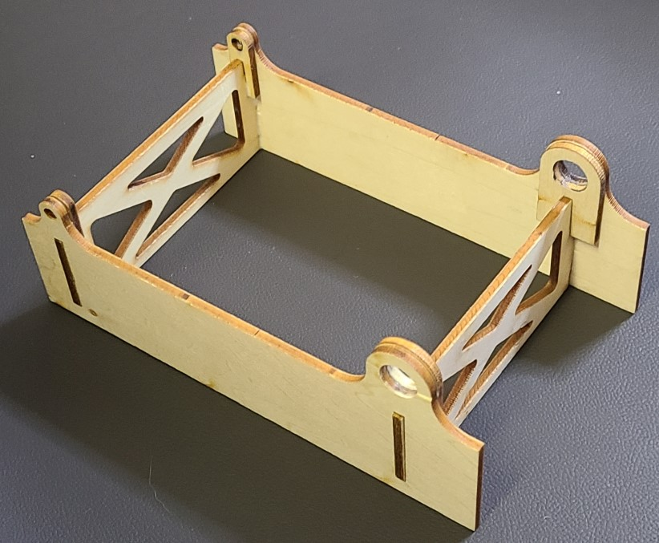

## Wood Frame
Assemble and glue the internal wooden box provided with the mini talon.
Eight pieces form the internal wooden frame.

Keep the four holes clear of glue so that the spars can slide thru (at a later step).

1. Locate the four walls of the internal frame and glue them together.
2. Glue the four tabs onto the inside surfaces per image.

