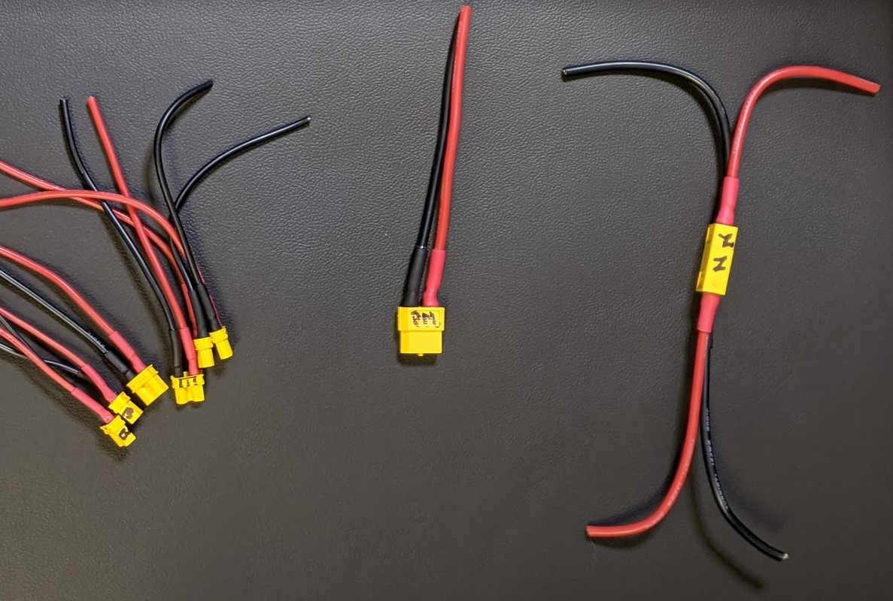

## XT to wires

Part summary:

* 12 AWG, red, 100mm
* 12 AWG, blk. 100mm
* 14 AWG, red, 300mm
* 14 AWG, blk, 300mm
* 20 AWG, red, 200mm
* 20 AWG, blk, 200mm
* 18 AWG, red, 400mm
* 18 AWG, blk, 400mm
* XT90 connector
* XT60 connector, qty 2 (or 1 male, 2 female)
* XT30 connector, qty 6 (or 6 female)
* heat shrink 3/16", 140mm (can do 70mm red and 70mm black)
* heat shrink 3/32", 180mm (can do 90mm red and 90mm black)

General instructions for each line in the table below:

* Cut a length of red cable and a length of black cable.
* Strip a few mm of insulation from ONE end of each wire. The other end will be stripped at a later step.
* Prior to soldering, connect the female and male connectors together in order to prevent deformation. Put tape over the end you aren't soldering to avoid soldering the wrong end.
* Solder the stripped end of the red cable to the + side of the connector (and solder black to -).
* cut 2 pieces of heat shrink. One at time, slide a piece over the wire where it was soldered. Slide it into the connector. You can gently touch around one end of it (the end closest to the XT connector) with a soldering iron to slightly pre-shrink that end. Then it can slide into the end of the XT connector for a better seal. Then use a heat gun to shrink the entire tube.
* Label the connector (per the table) for future reference.

| Connector (label) | Gage | Length per wire | Connector | Heat Shrink per wire |
|--|--|--|--|--|
| Battery (batt) | 12 AWG | 100mm | XT90 Male | 3:1, 20mm, 3/16" dia |
| Power Module (PM) | 14 AWG | 100mm | XT60 F | 3:1, 20mm, 3/16" dia |
| Node 1 (N1) | 14 AWG | 100mm | XT60 F | 3:1, 15mm, 3/16" dia |
| Node 2 (N2) | 14 AWG | 100mm | XT60 Male | 3:1, 15mm, 3/16" dia |
| BEC 1 (B) | 20 AWG | 100mm | XT30 F | 3:1, 15mm, 3/32" dia |
| BEC 2 (B) | 20 AWG | 100mm | XT30 F | 3:1, 15mm, 3/32" dia |
| quad ESC 1 (E) | 18 AWG | 100mm | XT30 F | 3:1, 15mm, 3/32" dia |
| quad ESC 2 (E) | 18 AWG | 100mm | XT30 F | 3:1, 15mm, 3/32" dia |
| quad ESC 3 (E) | 18 AWG | 100mm | XT30 F | 3:1, 15mm, 3/32" dia |
| quad ESC 4 (E) | 18 AWG | 100mm | XT30 F | 3:1, 15mm, 3/32" dia |
|  |  |  |  |  |

Here are two slightly different approaches for soldering XT connectors: [If the wire does not really fit into the holes](https://www.youtube.com/watch?v=L19amVtmP2c) and [if the wire easily fits into the holes](https://oscarliang.com/soldering-guide/#xt60).  

Suggestion: After this task is complete, immediately continue with the [power loom nodes](nodes.md).
